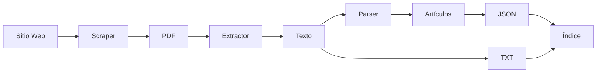

# 📖 Pipeline de Procesamiento Local

Documentación detallada del pipeline de scraping → procesamiento → almacenamiento local de BO-GOV-SCRAPER-BUHO.

---

## 📋 Tabla de Contenidos

- [Visión General](#visión-general)
- [Arquitectura](#arquitectura)
- [Flujo Paso a Paso](#flujo-paso-a-paso)
- [Estructura de Almacenamiento](#estructura-de-almacenamiento)
- [Sistema de Delta Updates](#sistema-de-delta-updates)
- [Formato de Datos](#formato-de-datos)
- [Extensibilidad](#extensibilidad)

---

## 🎯 Visión General

El pipeline de BÚHO procesa documentos legales bolivianos de forma automática, estructurada y controlable:

```
Sitio Web → Descarga PDF → Extracción de Texto → Parsing Legal → JSON + TXT → Índice
```

### Objetivos

1. **Automatización completa**: Desde descarga hasta estructuración
2. **Control granular**: Decidir qué guardar (PDF, TXT, JSON)
3. **Eficiencia**: Delta updates para procesar solo lo nuevo
4. **Calidad**: Texto limpio y estructura legal precisa
5. **Trazabilidad**: Logs y hashes para auditoría

---

## 🏗️ Arquitectura

### Componentes Principales

```
scraper/
├── pipeline.py              # Orquestador principal
├── models.py                # Modelos de datos
├── extractors/
│   └── pdf_extractor.py     # Extracción de texto/OCR
├── parsers/
│   └── legal_parser.py      # Parsing de estructura legal
└── sites/
    └── {site}_scraper.py    # Scrapers específicos por sitio
```

### Flujo de Datos



---

## 🔄 Flujo Paso a Paso

### 1. Inicialización

```python
from scraper import run_site_pipeline

result = run_site_pipeline(
    site_id='tcp',
    mode='delta',          # 'delta' o 'full'
    limit=50,
    save_pdf=False,
    save_txt=True,
    save_json=True
)
```

**Acciones:**
- Cargar configuración del sitio desde `config/sites_catalog.yaml`
- Inicializar scraper específico del sitio
- Cargar índice existente (para delta updates)
- Crear directorios si no existen

### 2. Listado de Documentos

```python
# En el scraper específico
documentos_metadata = scraper.listar_documentos(limite=50)
```

**Retorna:** Lista de diccionarios con metadata:
```python
{
    'id_documento': 'tcp_sc_0001_2024',
    'tipo_documento': 'Sentencia Constitucional',
    'numero_norma': '0001/2024',
    'fecha': '2024-01-15',
    'titulo': 'Sentencia Constitucional 0001/2024-S1',
    'url': 'https://...',
    'sumilla': '...'
}
```

### 3. Descarga de PDF

**Opciones:**

**A) Guardar PDF (si `save_pdf=True`)**
```
Destino: data/raw/{site}/pdfs/{id_documento}.pdf
```

**B) Archivo Temporal (si `save_pdf=False`)**
```python
temp_file = tempfile.NamedTemporaryFile(suffix='.pdf', delete=False)
# Procesar...
# Borrar al final
```

**Implementación:**
```python
success = scraper.descargar_pdf(url, ruta_destino)
```

### 4. Extracción de Texto

**Componente:** `PDFExtractor`

**Métodos de extracción:**

1. **PyPDF2** (primera opción)
   - Para PDFs digitales (texto seleccionable)
   - Rápido y eficiente

2. **Tesseract OCR** (fallback)
   - Para PDFs escaneados
   - Requiere conversión PDF → Imagen → OCR
   - Más lento pero necesario para documentos antiguos

**Proceso:**
```python
extractor = PDFExtractor(usar_ocr=True)
texto = extractor.extraer_texto(pdf_path)
```

**Normalización:**
- Eliminar caracteres de control
- Normalizar espacios en blanco
- Máximo 2 saltos de línea consecutivos
- Trim de espacios por línea

**Salida:**
```
Destino: data/normalized/{site}/text/{id_documento}.txt
Codificación: UTF-8
```

### 5. Parsing Legal

**Componente:** `LegalParser`

**Objetivo:** Dividir el texto en unidades semánticas legales

**Detección de Patrones:**

```python
# Artículos
ARTÍCULO 1.- Contenido del artículo...
Art. 5°.- Contenido...

# Secciones
SECCIÓN I - DISPOSICIONES GENERALES
CAPÍTULO II - DE LOS DERECHOS

# Disposiciones
DISPOSICIÓN TRANSITORIA PRIMERA.- ...
DISPOSICIÓN FINAL.- ...
```

**Algoritmo:**

1. Recorrer texto línea por línea
2. Detectar inicio de artículo/sección con regex
3. Acumular contenido hasta siguiente artículo
4. Crear objeto `Articulo` con:
   - `numero`: "1", "5", "I", etc.
   - `titulo`: Si existe (ej: "DEL OBJETO")
   - `contenido`: Texto completo
   - `tipo_unidad`: articulo, seccion, capitulo, disposicion

**Salida:**
```python
articulos = [
    Articulo(
        id_articulo='tcp_sc_0001_2024_art_1',
        numero='1',
        titulo='DEL OBJETO',
        contenido='El presente decreto...',
        tipo_unidad='articulo'
    ),
    # ...
]
```

### 6. Generación de JSON

**Estructura del Documento:**

```json
{
  "id_documento": "tcp_sc_0001_2024",
  "site": "tcp",
  "tipo_documento": "Sentencia Constitucional",
  "numero_norma": "0001/2024",
  "fecha": "2024-01-15",
  "titulo": "Sentencia Constitucional 0001/2024-S1",
  "url_origen": "https://...",
  "texto_completo": "...",
  "ruta_pdf": "data/raw/tcp/pdfs/tcp_sc_0001_2024.pdf",
  "ruta_txt": "data/normalized/tcp/text/tcp_sc_0001_2024.txt",
  "ruta_json": "data/normalized/tcp/json/tcp_sc_0001_2024.json",
  "hash_contenido": "a1b2c3d4...",
  "fecha_scraping": "2024-11-18T10:30:00",
  "fecha_ultima_actualizacion": "2024-11-18T10:30:00",
  "articulos": [
    {
      "id_articulo": "tcp_sc_0001_2024_art_1",
      "id_documento": "tcp_sc_0001_2024",
      "numero": "1",
      "titulo": "DEL OBJETO",
      "contenido": "El presente decreto...",
      "tipo_unidad": "articulo",
      "metadata": {}
    }
  ],
  "metadata": {
    "sumilla": "...",
    "otros_datos": "..."
  }
}
```

**Destino:**
```
data/normalized/{site}/json/{id_documento}.json
```

### 7. Actualización del Índice

**Archivo:** `data/index/{site}/index.json`

**Propósito:**
- Tracking de documentos procesados
- Delta updates (evitar reprocesar)
- Metadatos de última actualización

**Estructura:**

```json
{
  "last_update": "2024-11-18T10:30:00",
  "total_documentos": 150,
  "documentos": {
    "tcp_sc_0001_2024": {
      "hash": "a1b2c3d4...",
      "fecha_actualizacion": "2024-11-18T10:30:00",
      "ruta_pdf": "data/raw/tcp/pdfs/tcp_sc_0001_2024.pdf",
      "ruta_txt": "data/normalized/tcp/text/tcp_sc_0001_2024.txt",
      "ruta_json": "data/normalized/tcp/json/tcp_sc_0001_2024.json"
    }
  }
}
```

**Lógica de Delta Update:**

```python
# Verificar si el documento ya existe
if index.documento_existe(id_doc):
    if index.documento_cambio(id_doc, hash_nuevo):
        # Procesar (cambió)
    else:
        # Saltar (no cambió)
else:
    # Procesar (nuevo)
```

---

## 📂 Estructura de Almacenamiento

```
data/
├── raw/{site}/
│   └── pdfs/
│       ├── tcp_sc_0001_2024.pdf
│       ├── tcp_sc_0002_2024.pdf
│       └── ...
├── normalized/{site}/
│   ├── text/
│   │   ├── tcp_sc_0001_2024.txt
│   │   └── ...
│   └── json/
│       ├── tcp_sc_0001_2024.json
│       └── ...
└── index/{site}/
    └── index.json
```

### Directorios por Sitio

Cada sitio tiene su propia estructura:
- `tcp/`, `tsj/`, `asfi/`, `sin/`, `contraloria/`, `gaceta_oficial/`

### Rutas Configurables

Definidas en `config/settings.py` mediante `SiteConfig`:

```python
site_config.raw_pdf_dir        # data/raw/{site}/pdfs
site_config.normalized_text_dir # data/normalized/{site}/text
site_config.normalized_json_dir # data/normalized/{site}/json
site_config.index_file         # data/index/{site}/index.json
site_config.logs_dir           # logs/{site}
```

---

## 🔄 Sistema de Delta Updates

### Concepto

**Problema:** Reprocesar todo el archivo histórico en cada corrida es ineficiente.

**Solución:** Sistema de índices con hashing MD5.

### Funcionamiento

1. **Primera corrida (sitio vacío)**
   - Todos los documentos son nuevos
   - Procesar todos (hasta límite)
   - Crear índice

2. **Corridas subsecuentes (modo delta)**
   - Cargar índice existente
   - Comparar cada documento:
     - Si `id_documento` no existe en índice → **PROCESAR**
     - Si existe pero `hash` cambió → **PROCESAR**
     - Si existe y `hash` igual → **SALTAR**

3. **Modo full (histórico completo)**
   - Ignora delta check
   - Procesa todos (respetando límite)
   - Útil para reprocesar con nueva lógica de parsing

### Cálculo de Hash

```python
def calcular_hash(documento):
    content = f"{documento.texto_completo}{len(documento.articulos)}"
    return hashlib.md5(content.encode('utf-8')).hexdigest()
```

**Factores:**
- Texto completo
- Cantidad de artículos

**Cambio detectado si:**
- Texto fue corregido
- Parsing mejorado (más/menos artículos)

---

## 📊 Formato de Datos

### Archivo TXT

```
Texto normalizado, limpio, UTF-8
Una ley/sentencia por archivo
Saltos de línea preservados pero normalizados
```

### Archivo JSON

Ver sección "Generación de JSON" arriba.

**Ventajas:**
- Estructura semántica explícita
- Fácil consulta (jq, Python, etc.)
- Listo para base de datos
- Incluye metadata completa

### Índice JSON

Ligero, solo metadata esencial para delta updates.

---

## 🔌 Extensibilidad

### Agregar Nuevo Sitio

**1. Configurar en `config/sites_catalog.yaml`:**

```yaml
nuevo_sitio:
  id: nuevo_sitio
  nombre: "Nombre del Sitio"
  tipo: "Tribunal"
  url_base: "https://..."
  activo: true
  # ...
```

**2. Crear Scraper:**

`scraper/sites/nuevo_sitio_scraper.py`

```python
from .base_scraper import BaseScraper

class NuevoSitioScraper(BaseScraper):
    def __init__(self):
        super().__init__('nuevo_sitio')

    def listar_documentos(self, limite=None):
        # Implementar lógica específica
        pass

    def descargar_pdf(self, url, ruta_destino):
        # Implementar descarga
        pass
```

**3. Registrar en `scraper/sites/__init__.py`:**

```python
from .nuevo_sitio_scraper import NuevoSitioScraper

SCRAPERS = {
    # ...
    'nuevo_sitio': NuevoSitioScraper,
}
```

**4. Probar:**

```bash
python main.py scrape nuevo_sitio --limit 1
```

### Personalizar Parser Legal

Si un sitio tiene formato legal diferente, crear parser específico:

```python
class GacetaParser(LegalParser):
    PATRONES_ARTICULO = [
        # Patrones específicos para Gaceta
    ]
```

### Agregar Procesamiento Post-Download

Heredar y extender:

```python
def procesar_pdf(self, ruta_pdf, ruta_txt):
    texto = super().procesar_pdf(ruta_pdf, ruta_txt)
    # Procesamiento adicional
    return texto_procesado
```

---

## 🚦 Manejo de Errores

### Por Documento

Si un documento falla:
1. Se registra el error en `PipelineResult.errores`
2. Se continúa con el siguiente documento
3. No se actualiza el índice para ese documento
4. Se puede reintentar en próxima corrida

### Logging

```
logs/{site}/scrape_20241118_103000.log
```

Incluye:
- Timestamp de cada operación
- Errores detallados con stack trace
- Progreso (X/Y documentos)

---

## 📈 Optimizaciones Futuras

1. **Procesamiento paralelo** de documentos (multiprocessing)
2. **Caché de PDFs** descargados
3. **Compresión** de archivos antiguos
4. **Base de datos** SQLite/Postgres para búsquedas rápidas
5. **Webhooks** para notificaciones de nuevos documentos
6. **Validación de estructura** legal (linting)
7. **Extracción de entidades** (NER): nombres, fechas, referencias

---

## ✅ Checklist de Integración de Gaceta Oficial

- [x] Estructura de carpetas lista
- [x] Entrada en catálogo configurada
- [x] Pipeline genérico preparado
- [ ] Implementar `GacetaScraper`
- [ ] Implementar lógica de paginación por ediciones
- [ ] Parser específico para diferentes tipos de normas
- [ ] Testing con muestra de ediciones
- [ ] Documentar peculiaridades del sitio

---

**Última actualización:** 2025-11-18
